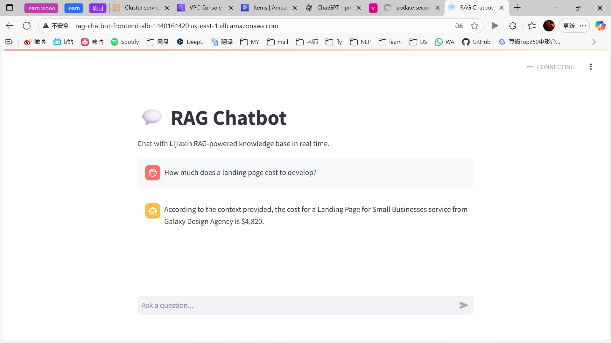
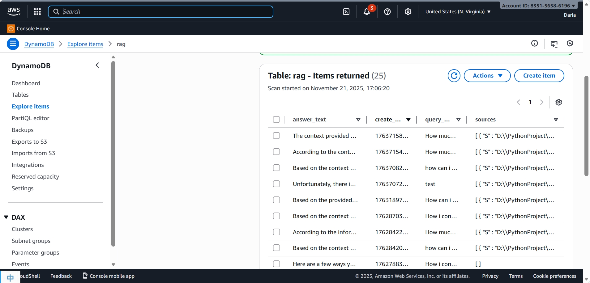
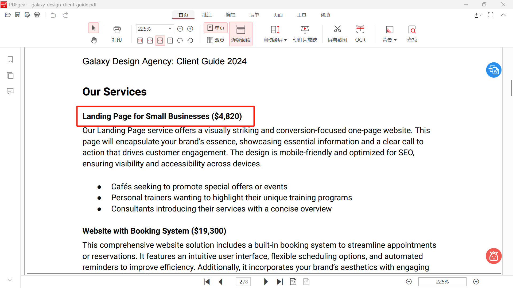

# 🚀 RAG Chatbot — Deploy to AWS (ECS + ALB + DynamoDB + ECR + S3)



This project provides a complete end-to-end pipeline for deploying a **RAG (Retrieval-Augmented Generation) chatbot** to AWS, including:

* Streamlit Frontend (Fargate / ECS)
* FastAPI Backend (Fargate / ECS)
* ALB (Application Load Balancer)
* Private subnets with NAT Gateway
* DynamoDB for query logs
* S3 for knowledge documents
* ECR for Docker image storage
* GitHub Actions CI/CD

---

# 📁 Project Structure

```
├── frontend/           # Streamlit UI
├── backend/            # FastAPI server with LangChain RAG
├── .github/workflows/  # CI/CD pipelines
├── rag-chatbot-backend-task-def.json
├── rag-chatbot-frontend-task-def.json
└── README.md
```

---

# 🧩 Architecture Overview

### 🔹 Frontend

* Deployed in **public subnet**
* Accessible via **ALB**
* Communicates with backend via internal URL

### 🔹 Backend

* Runs in **private subnets**
* Accesses **Amazon ECR** via NAT Gateway
* Reads knowledge data from S3
* Writes chat logs to DynamoDB

### 🔹 Networking

* Public Subnet → ALB
* Private Subnet → Backend Tasks + NAT Gateway
* Route tables configured for NAT + local VPC

### 🔹 CI/CD

* GitHub Actions automates:

  * Docker build
  * Push to ECR
  * ECS service deployment

---

# 🛠️ Prerequisites

Before deploying, ensure you have:

* AWS Account
* IAM user with required permissions
* AWS CLI installed
* GitHub repository with secrets configured:

  * `AWS_ACCOUNT_ID`
  * `AWS_ACCESS_KEY_ID`
  * `AWS_SECRET_ACCESS_KEY`
  * `AWS_REGION`
  * `FRONTEND_REPO`
  * `BACKEND_REPO`
  * `FRONTEND_SERVICE`
  * `BACKEND_SERVICE`
  * `CLUSTER`
  * `FRONTEND_CONTAINER`
  * `BACKEND_CONTAINER`
  

---

# 🏗️ Deployment Steps

## ① Create ECR in AWS

```
rag-chatbot-frontend
rag-chatbot-backend

```

## ② Set Github Secrets

```
○ AWS_ACCESS_KEY_ID
○ AWS_SECRET_ACCESS_KEY
○ AWS_DEFAULT_REGION
○ FASTAPI_URL --->http://<dns.name>
```

## ③ Create VPC, Elastic IP addresses and NAT Gateway. Verify Private Subnet's Route Table

### VPC:
    | Resources to Create | Name              | AZs | Public Subnets | Private Subnets |
    |---------------------|-------------------|-----|----------------|-----------------|
    | VPC and Networking  | rag-chatbot-vpc   | 2   | 2              | 2               |


### Route Table:
    Find the route table which is associated with the private subnets (2)
    Click **Routes** -> **Edit routes** -> **Add a new route**
    | Destination | Target      |
    |-------------|-------------|
    | 0.0.0.0/0   | NAT gateway |


## ④ Create Security Group && Target Group

| Security Group | VPC             | Inbound Rules                                 | Outbound Rules                         |
|----------------|-----------------|----------------------------------------------|----------------------------------------|
| **alb-sg**     | rag-chatbot-vpc | HTTP · TCP · 80 · **0.0.0.0/0**               | All traffic · All · All · 0.0.0.0/0    |
| **backend-sg** | rag-chatbot-vpc | Custom TCP · TCP · **8000** · **alb-sg**      | All traffic · All · All · 0.0.0.0/0    |
| **frontend-sg**| rag-chatbot-vpc | Custom TCP · TCP · **8501** · **alb-sg**      | All traffic · All · All · 0.0.0.0/0    |


| Property       | backend-tg          | Property       | frontend-tg         |
|----------------|---------------------|----------------|---------------------|
| **name**       | backend-tg          | **name**       | frontend-tg         |
| Target Type    | IP addresses        | Target Type    | IP addresses        |
| Protocol       | HTTP                | Protocol       | HTTP                |
| Port           | 8000                | Port           | 8501                |
| Health Check   | /health             | Health Check   | /                   |

## ⑤ Create ALB
### Create an Application Load Balancer (ALB)
  1. Select Application Load Balancer
  2. Set Scheme to Internet-facing
  3. Set IP address type to IPv4
  4. Choose your VPC (rag-chatbot-vpc)
  5. Select the two Public Subnets under this VPC
  6. Assign Security Group: alb-sg
  7. Configure Listener:
    * Protocol: HTTP
    * Port: 80
  8. Bind the Target Group: frontend-tg

* **Frontend URL:** Public ALB DNS (Streamlit UI)
* **Backend URL:** Internal load balancer or ECS service discovery

Set this in the frontend environment:

```
FASTAPI_URL="http://<backend-internal-url>"
```

### Configure Listener Rules
  1. Click the newly created ALB
  2. Go to Listeners and rules
  3. Select the existing listener (HTTP:80)
  4. Click Add rules


| Conditions (Path)                                | Action      | Priority |
|--------------------------------------------------|-------------|----------|
| /api/* , /api/submit_query , /submit_query       | backend-tg  | 2        |
| default                                          | frontend-tg | (default)|

## ⑥ AWS ECS Auto Deploy New Image
### create Cluster
### create Task Definition
frontend-task-def port mappings-container port : 8501
backend-task-def port mappings-container port : 8000
### create ECS Service (frontend + banckend)

# ⚙️ GitHub Actions Deployment

Enter  project path:
```
  git init
  git add .
  gti commit -m "Intial commit"
  git remote add origin https://github.com/YourUsername/rag-chatbot-aws.git
  git branch -M main
  [git tag v1.0.0.0]
  git push origin main
```

Future Code Update Workflow (No Manual Versioning Needed)
From now on, you only need to run:
```
git add .
git commit -m "Fix bugs or add features"
git push origin main
```

The CI/CD pipeline will automatically:
1. Check the latest tag (e.g., v1.0.0 → v1.0.1)
2. Generate a new version tag
3. Build the Docker image and push it to ECR
4. Update the ECS task definition
5. Perform a rolling deployment of the ECS service

---

# 🗄️ DynamoDB Schema

Table Name: `rag`

Partition Key:

```
query_id (string)
```

Attributes stored:

* `query_id`
* `create_time`
* `query_text`
* `answer_text`
* `sources`


---

# 🧪 Health Check Endpoints

### Backend

```
GET /health  → 200 OK
```

### Frontend

```
GET /  → 200 OK
```

Make sure ECS service health checks match these.

---

# 🛑 Stopping the App (Avoid AWS Charges)

To fully pause and avoid charges:

### Required to stop charge:

* Set **ECS Tasks = 0**
* Delete **NAT Gateway**
* Delete **ALB**
* Release **Elastic IP** used by NAT Gateway

---

# 🧩 Troubleshooting

### 🔥 Cannot pull image from ECR

* NAT Gateway missing
* Wrong route table for private subnet
* ECS task execution role missing:

  * `AmazonECSTaskExecutionRolePolicy`
  * `ecsTaskRole` missing `AmazonBedrockFullAccess' and `AmazonDynamoDBFullAccess`


If you need help adding **diagrams**, **CI/CD visualization**, or **Terraform IaC**, just let me know!
